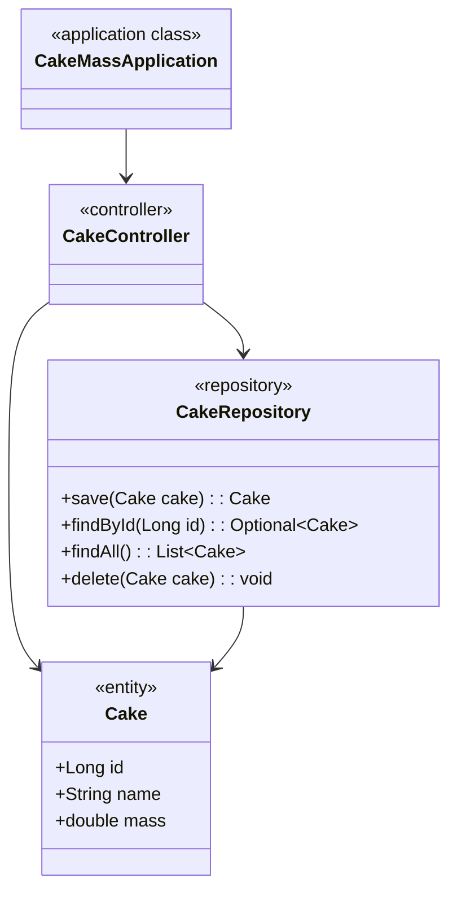

# Santender Dev 2024

```mermaid
classDiagram
    class CakeMassApplication {
        <<application class>>
    }

    class CakeController {
        <<controller>>
    }

    class Cake {
        <<entity>>
        +Long id
        +String name
        +double mass
    }

    class CakeRepository {
        <<repository>>
        +save(Cake cake) : Cake
        +findById(Long id) : Optional~Cake~
        +findAll() : List~Cake~
        +delete(Cake cake) : void
    }

    CakeMassApplication --> CakeController
    CakeController --> Cake
    CakeController --> CakeRepository
    CakeRepository --> Cake
```
